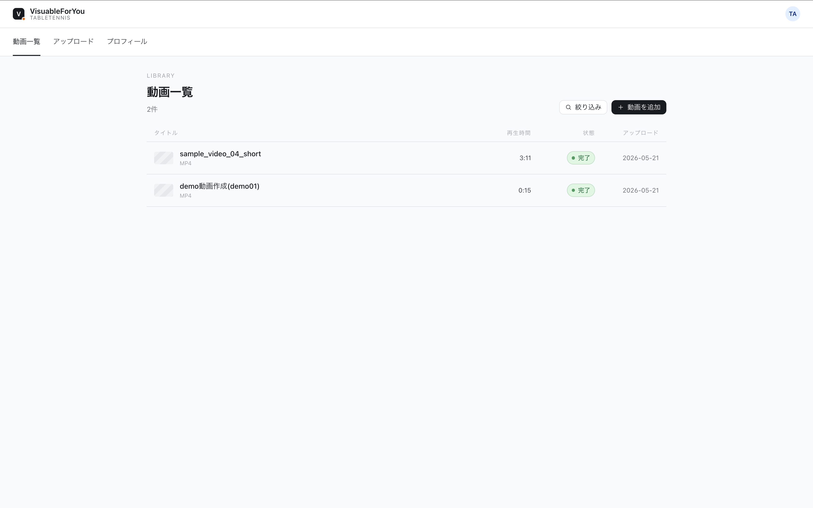
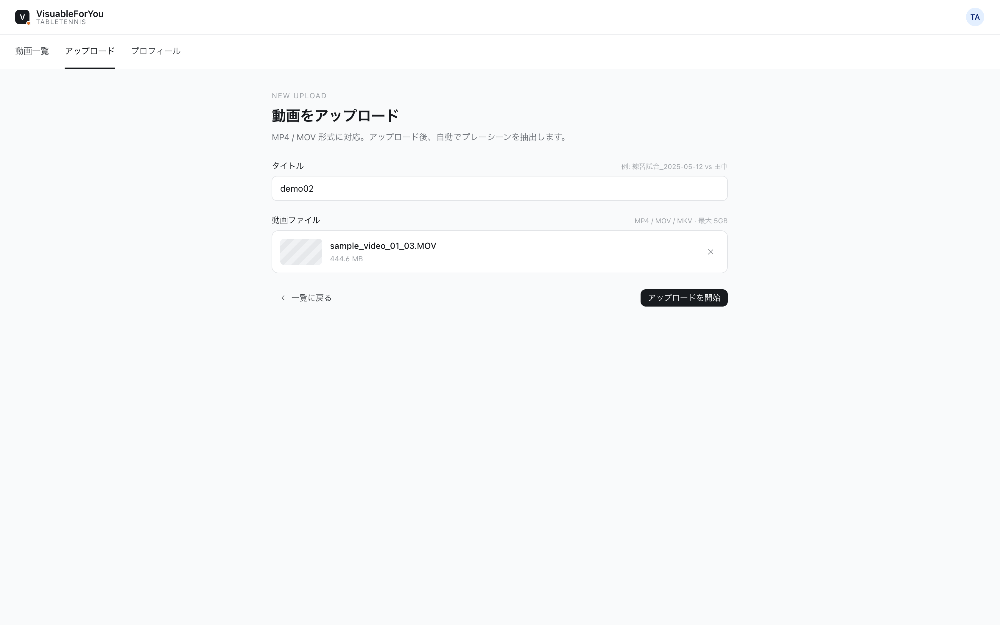
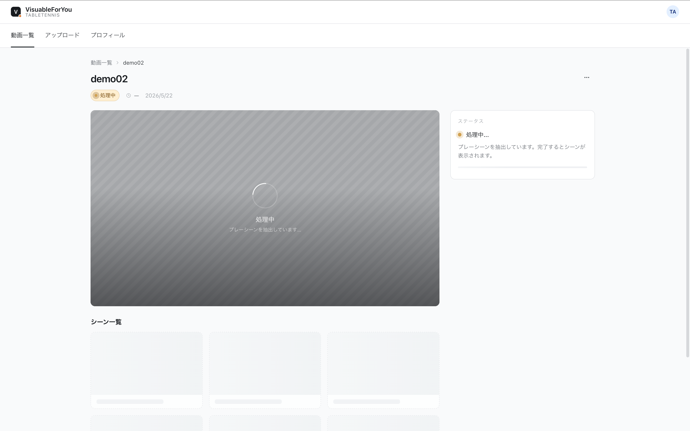
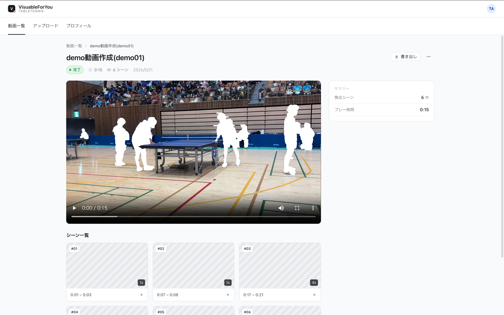
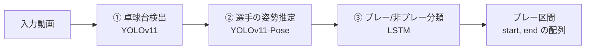

<div align="center">

# Visuable for You Tabletennis

**卓球試合映像から「プレー中の区間」だけを自動検出、ラリー中だけの動画を生成する Web アプリケーション**

[](https://visualize-tt.com/)

</div>

### snap.
---

<div align="center">
<table>
<tr>
<td align="center"><strong>Before（元の試合動画）</strong></td>
<td align="center"><strong>After（プレー区間だけ抽出）</strong></td>
</tr>
<tr>
<td align="center">
  <video src="https://github.com/user-attachments/assets/94b280ad-3f8c-4c40-8d47-bbe9747cb135" controls width="100%"></video><br/>
  ⏱ 1:10
</td>
<td align="center">
  <video src="https://github.com/user-attachments/assets/2b834427-0b67-4f7f-baaf-a49a0f2b77ac" controls width="100%"></video><br/>
  ⏱ 0:12
</td>
</tr>
</table>

<sub>※ デモ動画では 3 ラリー分を抽出しています。プライバシー保護のため、選手の顔など一部映像にモザイク加工を施しています。</sub>

</div>

## どんなアプリケーション？🏓
卓球をプレーしている人は自身の競技レベル向上のために、試合映像を撮影して後で振り返ることが多々あります。フォームの確認から戦術の振り返りなど、映像から得られる情報は多岐に渡り、競技レベル向上のためには欠かせないものです。

しかし、多くの試合を重ねるごとにスマートフォン容量の圧迫や、または試合映像振り返り時間の増加など、振り返ること自体が負担になってしまうことがあります。

ですが卓球は、実はプレーを[「していない」](#分類性能)時間が大半を占める競技です。そこで、試合映像から「プレー中」だけを自動検出し、ラリーだけの動画を生成することで、試合映像振り返りの負担を軽減することを目的としたアプリケーションです。

### UI.
<div align="center">

<table>
<tr>
<td align="center" width="50%">
  <br/>
  <sub><b>home</b></sub>
</td>
<td align="center" width="50%">
  <br/>
  <sub><b>upload</b></sub>
</td>
</tr>
<tr>
<td align="center" width="50%">
  <br/>
  <sub><b>waiting</b></sub>
</td>
<td align="center" width="50%">
  <br/>
  <sub><b>result（一部加工）</b></sub>
</td>
</tr>
</table>

</div>

---

### ユーザ体験.

1. **アカウント登録** — メールアドレスで新規登録 → 認証メールのリンクをクリック
2. **動画アップロード** — 試合の動画ファイルを画面にアップロード
3. **処理を待つ** — AI が動画を解析してプレー区間を検出（処理完了時にメール通知）
4. **ダウンロード** — プレーシーンだけを連結した動画を取得

---

## 主な機能

- **メール認証付きユーザー登録 / ログイン**（JWT）
- **動画アップロード**（大容量動画にも対応するチャンク分割アップロード）
- **AI による自動プレー区間検出**（卓球台検出 + 姿勢推定 + LSTM 時系列分類）
- **ハイライト動画の自動生成**（FFmpeg によるクリップ結合）
- **処理完了をメールで通知**（Resend API）
- **クラウドストレージ連携**（Cloudflare R2 / S3 互換）

---

## ML パイプライン



| ステップ | モデル | 役割 |
|---------|--------|------|
| ① 卓球台検出 | YOLOv11 (転移学習) | フレーム内の卓球台位置を特定し、選手抽出の基準とする |
| ② 姿勢推定 | YOLOv11-Pose | 各選手の骨格 17 キーポイントを抽出 |
| ③ プレー分類 | LSTM | 時系列の姿勢特徴量から「プレー中 / 非プレー中」を分類 |


### なぜ"骨格"という特徴量に注目したのか？
- **課題**: 
    - **アマチュア層への適用性**: プロの試合映像は画角が固定されているという前提が成り立ちやすい一方、アマチュア層は三脚撮影が中心で会場の狭さや撮影機材の制約から十分な画角を確保できないケースが多い
    - **ボール検出の難しさ**: 卓球のボールは小さく、また高速であるため検出の計算量がボトルネックとなる。加えて、画角によってはボールが映らないなどの問題もある
- **YOLO + LSTM のメリット**: 
    - **均一な特徴量抽出**: YOLO による選手の骨格特徴量抽出は、画角や撮影条件の違いに対して比較的ロバストである。これにより、LSTM は「プレー中 / 非プレー中」の分類に専念できるため、検出の安定性などが見込めると判断


### 分類性能

テスト試合映像 5 本（計 39,368 フレーム）でモデルを評価

| 動画 | シーン数 | Precision | Recall | F1 |
|---|---|---|---|---|
| 01 | 19 | 0.946 | 0.868 | 0.905 |
| 02 | 26 | 0.886 | 0.889 | 0.887 |
| 03 | 14 | 0.981 | 0.827 | 0.898 |
| 04 | 19 | 0.850 | 0.909 | 0.879 |
| 05 | 23 | 0.954 | 0.801 | 0.871 |

<div align="center">
  

  <sub>青線＝モデルが出力した「プレー中である確率」／赤破線＝判定閾値 0.5／緑帯＝正解のプレー区間／橙帯＝モデルが抽出した区間</sub>
</div>

確率はラリー中に 1.0 付近、非プレー中に 0.1〜0.2 付近で安定しており、緑帯と橙帯はほぼ重なっています。取りこぼしの大半はラリー端部の数フレーム分の欠けで、視聴上の影響は小さいと言えます。


## 技術スタック

<div align="center">

### Frontend


### Backend


### ML


### Infra / DevOps


</div>


## ML 学習スクリプトを Colab で動かす

`ml/scripts/notebooks/` には **Google Colab で実行可能な学習・推論ノートブック** が用意されています。
これは、Google Colab 上で卓球の映像を入力として、学習済みモデルを使ってプレー区間の抽出を end-to-end で体験することができます。

### ノートブック一覧

| # | Notebook | 内容 | Open in Colab |
|---|----------|------|----------------|
| 01 | `01_train_table_detector.ipynb` | 卓球台検出モデル (YOLOv11) の学習 | [](https://colab.research.google.com/github/TakuM-M/Visuable_for_you_tabletennis/blob/main/ml/scripts/notebooks/01_train_table_detector.ipynb) |
| 02 | `02_export_player_pose.ipynb` | 動画から選手の骨格データ (CSV) を抽出 | [](https://colab.research.google.com/github/TakuM-M/Visuable_for_you_tabletennis/blob/main/ml/scripts/notebooks/02_export_player_pose.ipynb) |
| 03 | `03_train_lstm_play_classifier.ipynb` | LSTM プレー分類モデルの学習 | [](https://colab.research.google.com/github/TakuM-M/Visuable_for_you_tabletennis/blob/main/ml/scripts/notebooks/03_train_lstm_play_classifier.ipynb) |
| 04 | `04_crip.ipynb` | 学習済みモデルを使って動画から区間切り抜きを行う | [](https://colab.research.google.com/github/TakuM-M/Visuable_for_you_tabletennis/blob/main/ml/scripts/notebooks/04_crip.ipynb) |

### Colab 実行のセットアップ手順

ノートブックは Google Drive 上の以下のパスをプロジェクトルートとして読み込みます。

```
/content/drive/MyDrive/Visuable_for_you_tabletennis/
```

#### リポジトリを Google Drive に配置

ローカルで本リポジトリをクローンし、`ml/` ディレクトリ配下を Google Drive にアップロード。

```
MyDrive/
└── Visuable_for_you_tabletennis/
    ├── src/              # ml/src/ をアップロード
    ├── scripts/          # ml/scripts/ をアップロード
    ├── configs/          # API キーや学習設定（後述）
    ├── data/             # データセット・動画
    └── models/           # 学習結果の保存先
```

> `ml/` 直下のフォルダ構成をそのまま Google Drive に置く形になります。

---

## License

MIT

## Author

**Takumi M.** ([@TakuM-M](https://github.com/TakuM-M))