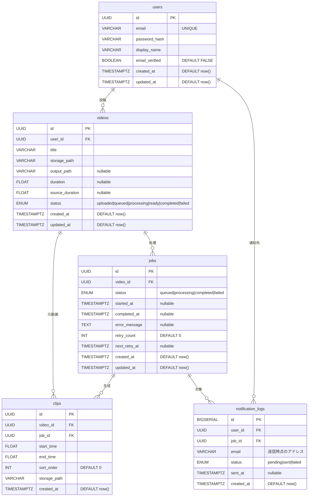

# データモデル

## ER図

## テーブル定義

### users — ユーザーアカウント

| カラム | 型 | NULL | 説明 |
|---|---|---|---|
| id | UUID | NOT NULL | PK |
| email | VARCHAR | NOT NULL UNIQUE | ログイン・通知先メールアドレス |
| password_hash | VARCHAR | NOT NULL | ハッシュ化済みパスワード |
| display_name | VARCHAR | NOT NULL | 表示名 |
| email_verified | BOOLEAN | NOT NULL DEFAULT FALSE | メール認証済みフラグ |
| created_at | TIMESTAMPTZ | NOT NULL | |
| updated_at | TIMESTAMPTZ | NOT NULL | |

### videos — アップロードされた動画

| カラム | 型 | NULL | 説明 |
|---|---|---|---|
| id | UUID | NOT NULL | PK |
| user_id | UUID | NOT NULL | FK → users.id |
| title | VARCHAR | NOT NULL | 動画タイトル |
| storage_path | VARCHAR | NOT NULL | 元動画のストレージパス |
| output_path | VARCHAR | NULLABLE | 書き出し済み連結動画のストレージパス。書き出し前は NULL |
| duration | FLOAT | NULLABLE | 書き出し済み出力動画の長さ（秒） |
| source_duration | FLOAT | NULLABLE | 元動画の長さ（秒）。アップロード時に設定。編集時の区間バリデーションに使用 |
| status | ENUM | NOT NULL | `uploaded` / `queued` / `processing` / `ready` / `completed` / `failed` |
| created_at | TIMESTAMPTZ | NOT NULL | |
| updated_at | TIMESTAMPTZ | NOT NULL | |

> `ready` は ML 解析が完了して切り抜きを編集できる状態（出力動画は未生成）。
> 出力動画はアップロード時ではなく**ユーザーの書き出し操作（`POST /videos/{id}/export`）時に初めて生成**され、
> `processing`（書き出し中）→ `completed`（出力済み）と遷移する。書き出しに失敗した場合は `ready` に戻す。

### jobs — 切り抜き処理ジョブ

| カラム | 型 | NULL | 説明 |
|---|---|---|---|
| id | UUID | NOT NULL | PK |
| video_id | UUID | NOT NULL | FK → videos.id |
| status | ENUM | NOT NULL | `queued` / `processing` / `completed` / `failed` |
| started_at | TIMESTAMPTZ | NULLABLE | 処理開始時刻 |
| completed_at | TIMESTAMPTZ | NULLABLE | 処理完了時刻 |
| error_message | TEXT | NULLABLE | 失敗時のエラー内容 |
| retry_count | INT | NOT NULL DEFAULT 0 | 自動リトライ回数 |
| next_retry_at | TIMESTAMPTZ | NULLABLE | 次回自動リトライ予定時刻 |
| created_at | TIMESTAMPTZ | NOT NULL | |
| updated_at | TIMESTAMPTZ | NOT NULL | |

> 動画とジョブのライフサイクルを分離することで、再処理・リトライが可能になる。
> `retry_count` / `next_retry_at` は失敗時の自動リトライ（指数バックオフ）の制御に使う。

### clips — 切り抜き区間（プレーシーン）

| カラム | 型 | NULL | 説明 |
|---|---|---|---|
| id | UUID | NOT NULL | PK |
| video_id | UUID | NOT NULL | FK → videos.id（元動画） |
| job_id | UUID | NOT NULL | FK → jobs.id。ユーザー編集で追加した区間は最新ジョブの id を流用する |
| start_time | FLOAT | NOT NULL | 開始位置（秒） |
| end_time | FLOAT | NOT NULL | 終了位置（秒） |
| sort_order | INT | NOT NULL DEFAULT 0 | 連結時の並び順（0 始まり） |
| storage_path | VARCHAR | NOT NULL | 予約フィールド（現状未使用。出力は videos.output_path に集約） |
| created_at | TIMESTAMPTZ | NOT NULL | |

> 切り抜きは ML が初期生成した後、ユーザーが一括置換（`PUT /videos/{id}/clips`）で
> 編集・新規追加・削除・並べ替えできる。`start_time` / `end_time` は元動画上の区間で、
> 連結動画は `sort_order` 昇順に結合して生成される。

### notification_logs — メール通知履歴

| カラム | 型 | NULL | 説明 |
|---|---|---|---|
| id | BIGSERIAL | NOT NULL | PK |
| user_id | UUID | NOT NULL | FK → users.id |
| job_id | UUID | NOT NULL | FK → jobs.id |
| email | VARCHAR | NOT NULL | 送信先アドレス（送信時点の値を記録） |
| status | ENUM | NOT NULL | `pending` / `sent` / `failed` |
| sent_at | TIMESTAMPTZ | NULLABLE | 実際の送信時刻 |
| created_at | TIMESTAMPTZ | NOT NULL | |
