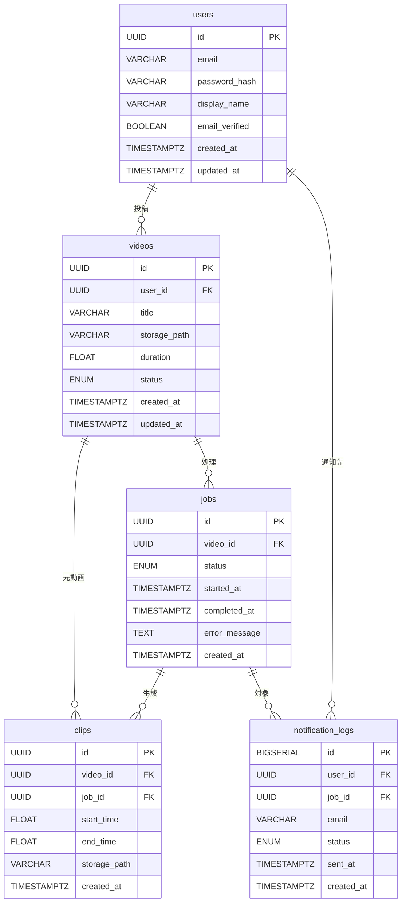

# データモデル

## ER図

## テーブル定義

### users — ユーザーアカウント

| カラム | 型 | NULL | 説明 |
|---|---|---|---|
| id | UUID | NOT NULL | PK |
| email | VARCHAR | NOT NULL UNIQUE | ログイン・通知先メールアドレス |
| password_hash | VARCHAR | NOT NULL | ハッシュ化済みパスワード |
| display_name | VARCHAR | NOT NULL | 表示名 |
| email_verified | BOOLEAN | NOT NULL DEFAULT FALSE | メール認証済みフラグ |
| created_at | TIMESTAMPTZ | NOT NULL | |
| updated_at | TIMESTAMPTZ | NOT NULL | |

### videos — アップロードされた動画

| カラム | 型 | NULL | 説明 |
|---|---|---|---|
| id | UUID | NOT NULL | PK |
| user_id | UUID | NOT NULL | FK → users.id |
| title | VARCHAR | NOT NULL | 動画タイトル |
| storage_path | VARCHAR | NOT NULL | ストレージ上のファイルパス |
| duration | FLOAT | NULLABLE | 動画長（秒）。アップロード後に設定 |
| status | ENUM | NOT NULL | `uploaded` / `queued` / `processing` / `completed` / `failed` |
| created_at | TIMESTAMPTZ | NOT NULL | |
| updated_at | TIMESTAMPTZ | NOT NULL | |

### jobs — 切り抜き処理ジョブ

| カラム | 型 | NULL | 説明 |
|---|---|---|---|
| id | UUID | NOT NULL | PK |
| video_id | UUID | NOT NULL | FK → videos.id |
| status | ENUM | NOT NULL | `queued` / `processing` / `completed` / `failed` |
| started_at | TIMESTAMPTZ | NULLABLE | 処理開始時刻 |
| completed_at | TIMESTAMPTZ | NULLABLE | 処理完了時刻 |
| error_message | TEXT | NULLABLE | 失敗時のエラー内容 |
| created_at | TIMESTAMPTZ | NOT NULL | |

> 動画とジョブのライフサイクルを分離することで、再処理・リトライが可能になる。

### clips — 生成された切り抜き動画

| カラム | 型 | NULL | 説明 |
|---|---|---|---|
| id | UUID | NOT NULL | PK |
| video_id | UUID | NOT NULL | FK → videos.id（元動画） |
| job_id | UUID | NOT NULL | FK → jobs.id（生成ジョブ） |
| start_time | FLOAT | NOT NULL | 開始位置（秒） |
| end_time | FLOAT | NOT NULL | 終了位置（秒） |
| storage_path | VARCHAR | NOT NULL | ストレージ上のファイルパス |
| created_at | TIMESTAMPTZ | NOT NULL | |

### notification_logs — メール通知履歴

| カラム | 型 | NULL | 説明 |
|---|---|---|---|
| id | BIGSERIAL | NOT NULL | PK |
| user_id | UUID | NOT NULL | FK → users.id |
| job_id | UUID | NOT NULL | FK → jobs.id |
| email | VARCHAR | NOT NULL | 送信先アドレス（送信時点の値を記録） |
| status | ENUM | NOT NULL | `pending` / `sent` / `failed` |
| sent_at | TIMESTAMPTZ | NULLABLE | 実際の送信時刻 |
| created_at | TIMESTAMPTZ | NOT NULL | |

> ユーザーがメールアドレスを変更した後でも送信履歴を追跡できるよう、送信時点のアドレスをスナップショットとして保持する。
