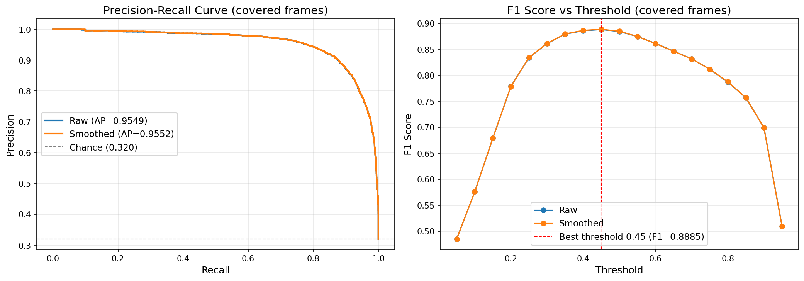

# プレー分類モデル（LSTM）検証評価レポート（2026-07-12）

学習済み LSTM プレー分類モデルを検証データで定量評価した結果のまとめ。

## 実験条件

- **モデル**: `models/play_classifier/lstm_model.pth`
- **検証データ**: 学習に使っていない 5 動画（05 / 07 / 08 / 12 / 14_train）、計 39,368 フレーム、陽性率 31.0%（動画別 29.0〜37.0%）
- **評価パラメータ**: sequence_length=30、threshold=0.5、メディアンフィルタ window=5、min_scene_duration=10、merge_gap=15（いずれも本番 `PlaySceneDetector` のデフォルトと同値）
- **評価スコープ**（姿勢データが 15fps 間引きのため予測はラベルフレームの約 47〜50% にのみ存在する。この扱いで 2 段階に分ける）:
  1. **分類器単体**: 姿勢データが存在するフレームのみで評価。LSTM そのものの性能
  2. **製品出力**: 本番と同じシーン抽出閾値 → 最小シーン長 → 近接マージで得た区間内フレームをプレー予測とし、全フレームで評価。ユーザが受け取るクリップの品質に相当

## 結果サマリ

全フレームをプールしたマイクロ平均（主指標）:

| スコープ | Precision | Recall | F1 | Accuracy |
|---|---|---|---|---|
| 分類器単体（生モデル, 閾値 0.5） | 0.918 | 0.853 | 0.884 | 0.929 |
| 分類器単体（後処理込み） | 0.919 | 0.854 | 0.885 | 0.929 |
| **製品出力（シーン区間展開後）** | **0.917** | **0.860** | **0.887** | 0.932 |
- F1 最大化閾値: 0.45（F1 = 0.8885）。現行の 0.5（F1 = 0.8849）との差は +0.004 で軽微

動画別（製品出力）:

| 動画 | シーン数 | Precision | Recall | F1 |
|---|---|---|---|---|
| 05_train | 19 | 0.946 | 0.868 | 0.905 |
| 07_train | 26 | 0.886 | 0.889 | 0.887 |
| 08_train | 14 | 0.981 | 0.827 | 0.898 |
| 12_train | 19 | 0.850 | 0.909 | 0.879 |
| 14_train | 23 | 0.954 | 0.801 | 0.871 |

## 図表

PR 曲線は recall 0.8 付近まで precision 0.95 超を維持しており、閾値の選び方に対して頑健。F1-閾値曲線は 0.35〜0.55 の範囲でほぼ平坦で、現行閾値 0.5 は妥当な位置にある。

緑帯（正解プレー区間）と橙帯（検出シーン）はほぼ重なる。誤検出シーンは少数（例: 12_train のフレーム 2700 付近）で、取りこぼしは主にラリー端部の数フレームずつの欠けとして現れている。